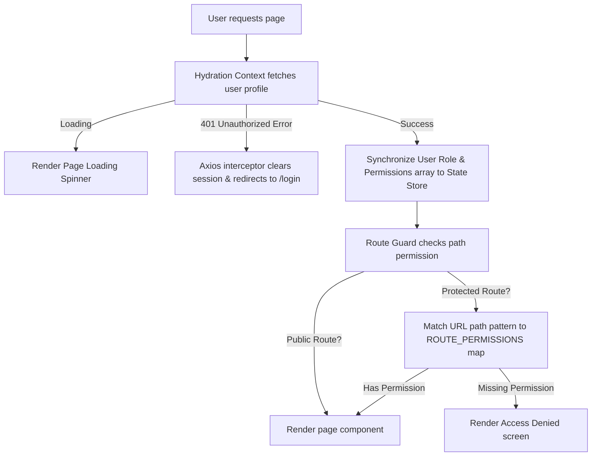

# React & Next.js Authentication and Role-Based Access Control (RBAC) Guide

This guide describes a clean, scalable architectural pattern for handling user authentication, session persistence, role-based authorization (RBAC), route guarding, and component-level action protection in React and Next.js applications.

---

## Table of Contents
1. [Architectural Overview](#1-architectural-overview)
2. [Session & Token Management](#2-session--token-management)
3. [Global API Security (Axios Interceptors)](#3-global-api-security-axios-interceptors)
4. [Global Authorization State (Zustand/Context)](#4-global-authorization-state-zustandcontext)
5. [Session Synchronization & Hydration](#5-session-synchronization--hydration)
6. [Route Guards (Page-Level Security)](#6-route-guards-page-level-security)
7. [Component-Level Action Protection](#7-component-level-action-protection)
8. [Dynamic Navigation & Sidebar Filtering](#8-dynamic-navigation--sidebar-filtering)

---

## 1. Architectural Overview

To build a secure and smooth user experience, authentication and authorization are handled in layers:



---

## 2. Session & Token Management

Authentication tokens (JWTs) are stored server-side inside an encrypted Iron Session cookie (`HttpOnly`, `Secure`, `SameSite: Lax`). The tokens never touch the browser's JavaScript — the Next.js BFF proxies the external REST API, injecting the `Authorization` header server-side for each request. This eliminates the XSS attack vector for token theft.

### Key design decisions
- The session cookie carries opaque encrypted data; the browser sees only a random-looking string.
- `proxy.ts` (the Next.js middleware) checks cookie presence for lightweight auth-gating (redirecting logged-in users from `/login`, redirecting unauthenticated users from `/dashboard`).
- Full role verification happens server-side at the page/API level with `requireAuth()` / `requireRole()`.

---

## 3. Global API Security (Axios Interceptors)

The Next.js BFF (Backend For Frontend) proxies all external API requests, injecting the access token server-side. The `proxy.ts` middleware provides lightweight cookie-presence checks, while `lib/auth/auth.ts` handles deep role verification.

### middleware (`proxy.ts`)
The proxy intercepts requests to:
- Redirect logged-in users away from `/login`, `/register`, etc.
- Redirect unauthenticated users away from `/dashboard`.
- Pass through `next-intl` i18n routing.

The session cookie's mere presence is the signal — no decryption happens at this layer.

```typescript
import { NextResponse } from "next/server"
import type { NextRequest } from "next/server"
import createMiddleware from "next-intl/middleware"

const SESSION_COOKIE_NAME = "session"
const PROTECTED_PREFIXES = ["/dashboard"]

export function proxy(request: NextRequest): NextResponse {
  const { pathname } = request.nextUrl
  if (pathname.startsWith("/api/")) return NextResponse.next()

  const isLoggedIn = !!request.cookies.get(SESSION_COOKIE_NAME)?.value
  const { localePath } = extractLocaleAndPath(pathname)

  if (PROTECTED_PREFIXES.some((p) => localePath.startsWith(p)) && !isLoggedIn) {
    return NextResponse.redirect(new URL(`/login`, request.url))
  }

  return intlMiddleware(request)
}
```

---

## 4. Global Authorization State (Zustand/Context)

A client-side state store is used to cache the user and role, enabling fast, synchronous role evaluations in the UI.

### Auth Store (`useAuthStore.ts`)
```typescript
import { create } from "zustand"
import type { SessionUser, UserRole } from "@/types/auth"

interface AuthState {
  user: SessionUser | null
  isHydrated: boolean
  setUser: (user: SessionUser | null) => void
  setHydrated: (hydrated: boolean) => void
  hasRole: (role: UserRole) => boolean
  hasAnyRole: (roles: UserRole[]) => boolean
  isLoggedIn: () => boolean
}

export const useAuthStore = create<AuthState>((set, get) => ({
  user: null,
  isHydrated: false,
  setUser: (user) => set({ user }),
  setHydrated: (hydrated) => set({ isHydrated: hydrated }),
  hasRole: (role) => get().user?.role === role,
  hasAnyRole: (roles) => {
    const user = get().user
    return user ? roles.includes(user.role) : false
  },
  isLoggedIn: () => get().user !== null,
}))
```

---

## 5. Session Synchronization & Hydration

Upon application startup, or during a page load, a React context provider fetches the authenticated user's profile and synchronizes the active role with the global state store.

### AuthProvider (`auth-provider.tsx`)
```typescript
"use client"

import { useEffect } from "react"
import { useQuery } from "@tanstack/react-query"
import { useAuthStore } from "@/features/auth/store/useAuthStore"
import type { SessionUser } from "@/types/auth"

async function fetchCurrentUser(): Promise<SessionUser | null> {
  const response = await fetch("/api/auth/me", { credentials: "include" })

  if (response.status === 401 || response.status === 403) return null
  if (!response.ok) throw new Error("Failed to fetch user profile")

  const json = (await response.json()) as { data?: { user?: SessionUser } }
  return json.data?.user ?? null
}

export function AuthProvider({ children }: { children: React.ReactNode }) {
  const setUser = useAuthStore((s) => s.setUser)
  const setHydrated = useAuthStore((s) => s.setHydrated)

  const { data: user, isError } = useQuery({
    queryKey: ["auth", "me"],
    queryFn: fetchCurrentUser,
    retry: false,
    staleTime: 5 * 60 * 1000,
    refetchOnWindowFocus: false,
  })

  useEffect(() => {
    if (user !== undefined) {
      setUser(user)
      setHydrated(true)
    }
  }, [user, setUser, setHydrated])

  useEffect(() => {
    if (isError) {
      setUser(null)
      setHydrated(true)
    }
  }, [isError, setUser, setHydrated])

  return <>{children}</>
}
```

---

## 6. Route Guards (Page-Level Security)

Protected route guards inspect path requirements during navigation. In Next.js, pages are guarded in their layout via `requireRole` or the non-throwing `hasRole`.

### Server-side helpers (`lib/auth/auth.ts`)

Three helpers cover all server-side auth needs:

| Helper | Returns | Throws? | Use when… |
|---|---|---|---|
| `getCurrentUser()` | `SessionUser \| null` | Never | You want to optionally read the user |
| `requireAuth()` | `SessionUser` | `AuthenticationError` (401) | The page/action requires login |
| `requireRole(roles)` | `SessionUser` | `AuthenticationError` \| `AuthorizationError` (403) | The page/action requires a specific role |
| `hasRole(roles)` | `{ user, ok }` | Never | You want to branch on roles without try/catch |

```typescript
import { requireRole } from "@/lib/auth/auth"
import { AuthenticationError, AuthorizationError } from "@/lib/auth/errors"
import { redirect } from "next/navigation"

export default async function DashboardLayout({ children, params }: { children: React.ReactNode; params: Promise<{ locale: string }> }) {
  const { locale } = await params

  let authError = null
  try {
    await requireRole(["admin", "manager"])
  } catch (error) {
    if (error instanceof AuthenticationError) authError = "unauthenticated"
    else if (error instanceof AuthorizationError) authError = "unauthorized"
    else throw error
  }

  if (authError === "unauthenticated") redirect(`/${locale}/login`)
  if (authError === "unauthorized") redirect(`/${locale}`)

  return <>{children}</>
}
```

### Non-throwing role branching in Server Components

Use `hasRole()` when you need to optionally render content for privileged users without a try/catch block:

```typescript
import { hasRole } from "../lib/auth/auth"

export default async function AdminNavLink() {
  const { ok } = await hasRole(["admin", "manager"])
  if (!ok) return null
  return <DashboardLink />
}
```

---

## 7. Component-Level Action Protection

Beyond blocking whole pages, specific actions (buttons, links, menu items) are selectively shown or hidden according to authentication status and role.

### Read-only hook (`useAuth`)

```typescript
// features/auth/hooks/useAuth.ts
"use client"

import { useAuthStore } from "@/features/auth/store/useAuthStore"
import type { UserRole } from "@/types/auth"

export function useAuth() {
  const user = useAuthStore((s) => s.user)
  const isHydrated = useAuthStore((s) => s.isHydrated)
  const hasRole = useAuthStore((s) => s.hasRole)
  const hasAnyRole = useAuthStore((s) => s.hasAnyRole)
  const isLoggedIn = useAuthStore((s) => s.isLoggedIn)

  return {
    user,
    isHydrated,
    isAuthenticated: isHydrated && user !== null,
    isLoading: !isHydrated,
    role: (user?.role ?? null) as UserRole | null,
    hasRole,
    hasAnyRole,
    isLoggedIn,
  }
}
```

Mutations (`setUser`, `setHydrated`) are excluded from `useAuth()` — call `useAuthStore` directly for those.

### Example — inline usage:

```tsx
import { useAuth } from "@/features/auth/hooks/useAuth"

export function SomeComponent() {
  const { hasAnyRole, isAuthenticated } = useAuth()

  return (
    <div>
      {isAuthenticated && hasAnyRole(["admin", "manager"]) && (
        <AdminPanel />
      )}
    </div>
  )
}
```

### Declarative guards (`<SignedIn>`, `<SignedOut>`, `<HasRole>`)

Clerk-style wrapper components for cleaner, declarative conditional rendering:

```tsx
// features/auth/components/Guards.tsx
import { SignedIn, SignedOut, HasRole } from "@/features/auth/components/Guards"

function Navbar() {
  return (
    <div>
      {/* User menu only when logged in; login/register buttons when not */}
      <SignedIn>
        <UserDropdown />
      </SignedIn>
      <SignedOut>
        <LoginButton />
        <RegisterButton />
      </SignedOut>

      {/* Dashboard link only for admin/manager */}
      <HasRole roles={["admin", "manager"]}>
        <DashboardLink />
      </HasRole>
    </div>
  )
}
```

All guards accept an optional `fallback` prop (defaults to `null`). Until hydration completes, guards render `null`, preventing flash of wrong content.

### Security note

Client-side guards and `useAuth()` are **presentational only** — they control what the user sees, not what they can access. All authorization enforcement happens server-side via `requireAuth()` / `requireRole()`. A malicious user could inspect/alter client state, but every protected API route and server action independently verifies the session.

---

## 8. Dynamic Navigation & Sidebar Filtering

Navigation menus (such as sidebars or headers) should automatically hide links to modules the user is forbidden from viewing.

### Filtering Configuration & Recursive Logic
```typescript
type NavItem = {
    title: string;
    url: string;
    roles: UserRole[] | null;
    nested?: NavItem[];
};

export const MENU_ITEMS: NavItem[] = [
    {
        title: "Dashboard",
        url: "/dashboard",
        roles: null // Publicly accessible to logged-in users
    },
    {
        title: "User Management",
        url: "#",
        roles: null,
        nested: [
            { title: "Users List", url: "/dashboard/users", roles: ["admin", "manager"] },
            { title: "Roles Config", url: "/dashboard/roles", roles: ["admin"] }
        ]
    }
];

export function useFilteredMenu(items: NavItem[]): NavItem[] {
    const { hasAnyRole } = useAuthStore.getState()

    return items
        .map((item) => {
            // Check role for current item
            const hasParentAccess = !item.roles?.length || hasAnyRole(item.roles)
            if (!hasParentAccess) return null

            // If it has children, recursively filter them
            if (item.nested) {
                const filteredChildren = item.nested.filter(
                    (child) => !child.roles?.length || hasAnyRole(child.roles)
                )

                // If all children are filtered out, hide the parent item completely
                if (filteredChildren.length === 0) return null

                return { ...item, nested: filteredChildren }
            }

            return item
        })
        .filter((item): item is NavItem => item !== null)
}
```
Using this logic, the sidebar receives only items that the active user is fully authorized to see, providing a tailored, noise-free interface.
